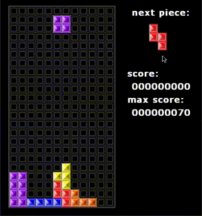
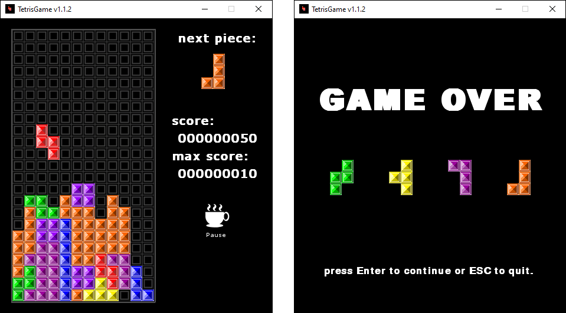

<p align="center">
  <h1>🧠 Clone Tetris Game 🧠</h1>
  <h6>by <i>FranciscoCharles</i></h6>
</p>
<p align="justify">

Este projeto é uma implementação em **Python**+**Pygame** do clássico jogo conhecido como Tetris. O objetivo 
foi recriar esse jogo nostálgico da infância de varias pessoas mundo a fora.

</p>

<div align="center">
    
    <br>
    <h6>
        Figure 1 - exemplo de gameplay.
    </h6>  
</div>

# <a name=index>Indice📚</a>
- [**O que o jogo possui?**](#o_que_o_jogo_possui)
- [**Controles**](#controles)
- [**Como executar?**](#run)
- [**Dependências**](#dependencies)
- [**Versão**](#version)
- [**Licença**](#license)
- [**Leitura adicional**](#leitura_adicional)

# **<a name=o_que_o_jogo_possui>🎮 O que o jogo possui?</a>** <h6>[voltar ao indice](#index)</h6>

 - controles fáceis de usar.
 - um sistema básico de armazenamento de pontuações.
 - um sistema costumizavel de controle de som: 
    + escolha qualquer música que voce possua para jogar.

Para customizar os sons edite o `sound.json`:
  - use `.mp3` para a `music`.
  - use `.wav` para `sound` e `game-over`, para esses efeitos utilize sons de poucos segundos de comprimento.

Um exemplo válido seria como abaixo:
```json
{
    "music":"your_music_example.mp3",
    "sound":"your_sound_effect_sound.wav",
    "game-over":"your_sound_effect_game_over.wav"
}
```

Onde `your_music_example.mp3`,`your_sound_effect_sound.wav`,`your_sound_effect_game_over.wav` estão na mesma pasta do arquivo `main.py`

Você tambem pode passar o caminho completo para as musicas, como no exemplo abaixo:
```json
{
    "music":"./my_path_folder/your_music_example.mp3",
    "sound":"./my_path_folder/your_sound_effect_score.wav",
    "game-over":"./my_path_folder/your_sound_effect_game_over.wav"
}
```

# **<a name=controles>🕹️🎮 Controles 🎮🕹️</a>** <h6>[voltar ao indice](#index)</h6>

<div align="center">
    
    <br>
    <h6>
        Figure 1 - exemplo telas.
    </h6>  
</div>

Use :arrow_left:, :arrow_right:, :arrow_up:, :arrow_down:, <kbd>A</kbd>, <kbd>S</kbd>,<kbd>W</kbd> e <kbd>Z</kbd> para mover a peça. Tambem é possivel segurar a tecla para mover a peça de forma mais rápida.

Pressione <kbd>P</kbd> ou <kbd>espaço</kbd> para pausar o jogo, um icone de xicara com um texto pause deve surgir na tela para indicar o pause.

Na tela de `Game Over` pressione <kbd>Enter</kbd> para jogar novamente ou <kbd>Esq</kbd> para sair do jogo.

Sobre a pontuação do jogo, a cada linha completa o jogador ganhará:

+ 1 linha = 10 pontos.
+ 2 linha = 30 pontos.
+ 3 linha = 60 pontos.
+ 4 linha = 100 pontos.

# **<a name=run> ⚙️ Como executar? 🧠💭</a>** <h6>[voltar ao indice](#index)</h6>

 Faça o download do projeto, entre na pasta `src` e instale as dependências. Para executar utilize o comando abaixo:
 ```bash
 python main.py
 ```
# **<a name=dependencies>Dependências</a>**  <h6>[voltar ao indice](#index)</h6>

- [**Pygame**](https://pypi.org/project/pygame/) **>= 1.9.6**
- [**Pillow**](https://pypi.org/project/Pillow/) **>= 8.2.0**

# **<a name=version>Versão</a>**  <h6>[voltar ao indice](#index)</h6>
- versão atual do projeto: 1.1.2.

# **<a name=license>Licença</a>**  <h6>[voltar ao indice](#index)</h6>

Para mais informações sobre a licença deste projeto, leia o arquivo <a href="./LICENSE" title="go to license file">LICENSE</a>.

# **<a name=leitura_adicional>📚 Leitura adicional 🔎</a>**  <h6>[voltar ao indice](#index)</h6>
Para entender melhor o jogo, você pode acessar:
+ [Wikipedia](https://en.wikipedia.org/wiki/Tetris)
---
<p align="center">
    Copyright © 2021 <b>FranciscoCharles</b>
</p>